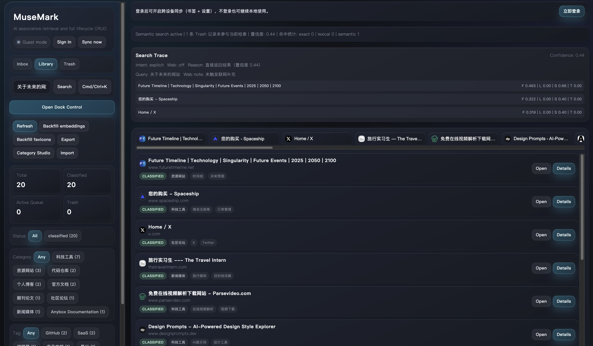
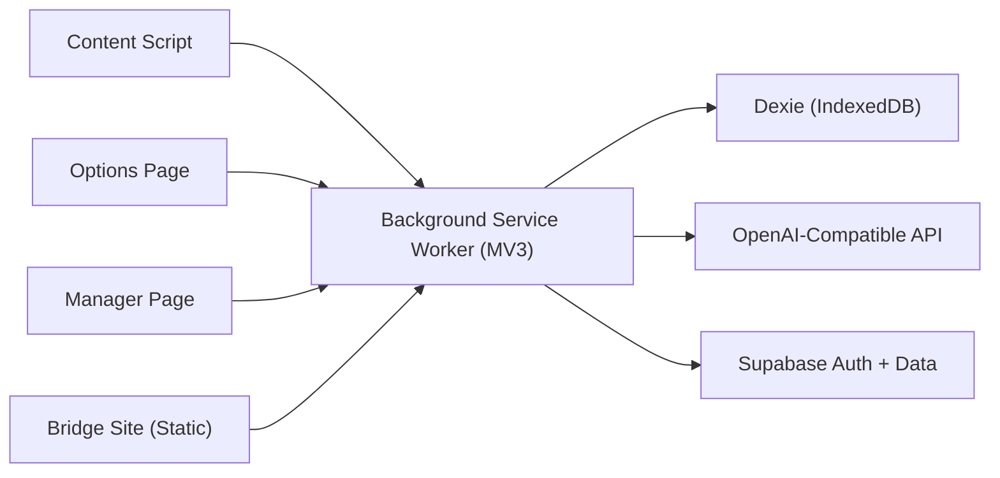

# MuseMark (auto_note)

> AI 驱动的 Chrome 书签工作流扩展：一键保存、智能分类、语义检索、QuickDock 快捷访问、可选云同步。

一个偏工程化的“阶段性可发布版本”项目，目标是让高频信息采集和复用流程更稳定、更可追溯、更低摩擦。

## 目录

- [项目概览](#overview)
- [阶段状态（Phase Snapshot）](#phase-snapshot)
- [核心功能](#features)
- [技术架构](#architecture)
- [项目结构](#project-structure)
- [快速开始](#quick-start)
- [配置说明](#configuration)
- [云同步与 Auth Bridge（可选）](#cloud-sync-and-auth-bridge)
- [开发与发布](#development-and-release)
- [数据与隐私说明](#data-and-privacy)
- [路线图](#roadmap)
- [常见问题（FAQ）](#faq)
- [贡献指南](#contributing)
- [许可证](#license)

<a id="overview"></a>

## 项目概览

### 这个项目解决什么问题

传统书签工具在以下场景体验较差：

- 收藏动作快，但后续整理慢
- 关键词想不起来时，检索命中率低
- 书签“存了就忘”，缺少回收与再利用机制

MuseMark 的思路是把“保存-理解-组织-召回”串成一个闭环：

1. 用户通过快捷键触发保存当前页面
2. 内容脚本抓取页面信息并回传后台
3. 后台执行 AI 摘要与分类（并维护 embedding）
4. Manager 提供紧凑列表、命令面板与语义检索
5. QuickDock 在网页侧持续提供快捷访问入口
6. 可选接入 Supabase，实现账号与跨端同步

### 命名说明

- 仓库目录名：`auto_note`
- 产品名与扩展名：`MuseMark`

<a id="phase-snapshot"></a>

## 阶段状态（Phase Snapshot）

当前可视为 **v0.1.1 阶段（2026-02，可内部使用/可提审）**，核心闭环已打通。

| 模块 | 当前状态 | 说明 |
| --- | --- | --- |
| 本地保存与去重 | 完成 | 支持 URL/canonical URL、保存次数、状态流转 |
| AI 摘要与分类 | 完成 | 双阶段流程（analyze + classify），失败可回退/重试 |
| 语义检索 | 完成 | lexical + semantic + taxonomy + recency 混合排序 |
| 低置信度澄清 | 完成 | 模糊查询可触发澄清选项，二次排序 |
| Manager 搜索体验 | 完成 | 搜索区升级为三段式（语义提示 + 主搜索 + 次操作），输入框更醒目，窄屏不再被按钮挤压 |
| QuickDock | 完成 | 网页侧常驻入口，支持右侧竖向 / 底部居中横向切换；支持 pin/dismiss、Pinned 拖拽重排（Options + 页面 Dock）与数字快捷键；已完成关闭控件中轴对齐与瀑布流展开/收起动画 |
| 构建稳定性（Content Script） | 完成 | 修复 content script 顶层模块引入导致的注入报错，确保 `dist/content.js` 可被 MV3 `content_scripts` 正常加载 |
| 回收站生命周期 | 完成 | Trash / Restore / Permanent Delete / Retention 清理 |
| 导入导出 | 完成 | Manager 端 JSON 导入导出 |
| 分类规则工作台 | 完成 | Canonical + aliases 管理 |
| Supabase 登录与同步 | 完成（可选） | Google OAuth + Magic Link + 本地迁移上云 |
| 自动化测试与 CI | 待完善 | 当前以手动验证和 `tsc` 检查为主 |

<a id="features"></a>

## 核心功能

### 1) 一键保存与智能分类

- 快捷键：`Cmd/Ctrl + Shift + S`
- 捕获页面标题、URL、域名、选中文本/正文片段
- AI 输出摘要、推荐分类、标签和置信度
- 支持分类模式：
  - `by_type`（默认）：按链接来源类型分类（博客/文档/论文/工具等）
  - `by_content`：按页面主题内容分类

### 2) Manager 管理中心

- 视图：`Home(紧凑列表)`
- 范围：`Inbox / Library / Trash`
- 操作：编辑分类/标签/备注、重试 AI、回收站操作
- 搜索交互：`Ask naturally` 支持回车执行搜索，支持 `Back` 快速返回默认列表
- 命令面板：`Cmd/Ctrl + K`
- 工具：embedding 回填、favicon 回填、导入导出、分类规则管理
- Dock 入口：提供明显按钮跳转至 `Options` 的 Dock Control 页面



### 3) 语义检索与可解释排序

- 混合评分：`semantic + lexical + taxonomy + recency`
- 结果附带 `whyMatched` 与分数追踪（trace）
- 模糊意图可触发澄清问题，提升召回质量
- 支持可选 Web Augment（联网意图扩展）

### 4) QuickDock（网页侧快速入口）

- 支持位置切换：右侧竖向 / 下方居中横向（浏览器网页内）
- 默认展示 Top10 常用书签（打开频次 + 时间衰减）
- 支持 pin/unpin、临时 dismiss
- 支持 Pinned 拖拽重排：
  - `Options > Dock Control > Pinned to Dock` 可拖拽调整
  - 页面内 QuickDock 图标可直接拖拽调整
- 支持快捷键直达：`Ctrl + 1..0`
- 支持从 Dock 快速打开 Library 或保存当前页
- 支持在 `Options` 中分区管理：
  - `Pinned to Dock`（手动 Pin 区）
  - `Suggested for Dock`（算法推荐区，支持 Pin/Unpin）
- 关闭控件已升级为深灰未来风格，并与书签列保持同一中轴对齐
- 展开/收起采用自上而下瀑布流过渡（约 300ms 节奏），避免瞬时跳变
- Dock 非图标区域保持透明策略，仅图标本体保持不透明

### 5) 可选云同步与账号体系

- 认证方式：
  - Google OAuth（`chrome.identity`）
  - Email Magic Link（经 Auth Bridge 回传扩展）
- 数据可同步至 Supabase（书签、分类规则、部分设置）
- 首次登录支持本地数据迁移上云

<a id="architecture"></a>

## 技术架构



### 架构要点

- **单一后台编排**：所有关键状态机与数据写入在 `background`，避免多端写冲突。
- **本地优先**：核心功能不依赖云即可工作；云同步为可选增强。
- **能力边界**：QuickDock 运行在浏览器网页上下文，不能跨整个 macOS 系统常驻显示。
- **权限策略**：为网页内常驻 Dock 启用全站注入；AI/Supabase 请求仍按域名权限控制。
- **作业化后台任务**：embedding 回填、回收站清理、同步由 alarms + job lease 驱动。

<a id="project-structure"></a>

## 项目结构

```text
auto_note/
├─ src/
│  ├─ background/        # MV3 service worker，核心业务编排
│  ├─ content/           # 页面注入层（捕获、Overlay、QuickDock）
│  ├─ manager/           # 管理中心 UI（通过 manager/index.html 挂载）
│  ├─ options/           # 配置页 UI
│  └─ shared/            # 类型、消息协议、设置模型
├─ public/manifest.json  # 扩展清单
├─ bridge-site/          # Auth Bridge + 隐私/条款静态页
├─ docs/
│  ├─ store/             # 上架准备说明
│  └─ supabase/          # Supabase 建表与接入说明
├─ releases/             # 历史打包产物
└─ dist/                 # 构建输出（加载为 unpacked extension）
```

<a id="quick-start"></a>

## 快速开始

### 前置要求

- Node.js 20+（建议 LTS）
- Chrome（支持 Manifest V3）

### 1) 安装依赖

```bash
npm install
```

### 2) 构建扩展

```bash
npm run build
```

构建产物位于 `dist/`。

### 3) 本地加载扩展

1. 打开 Chrome：`chrome://extensions/`
2. 打开“开发者模式”
3. 选择“加载已解压的扩展程序”
4. 选择项目下的 `dist/` 目录

### 4) 最小可用验证

1. 打开任意 HTTPS 页面
2. 触发 `Cmd/Ctrl + Shift + S`
3. 点击扩展图标进入 Manager
4. 检查条目是否出现在 Inbox/Library，并尝试编辑分类/标签
5. 打开网页 DevTools Console，确认没有 `Cannot use import statement outside a module` 报错

<a id="configuration"></a>

## 配置说明

在扩展 `Options` 页面配置关键参数。


| 配置项 | 说明 | 默认值 |
| --- | --- | --- |
| `baseUrl` | OpenAI 兼容 API 地址 | `https://api.openai.com` |
| `apiKey` | AI 服务密钥（仅本地存储） | 空 |
| `model` | 对话模型 | `gpt-4.1-mini` |
| `embeddingModel` | 向量模型 | `text-embedding-3-small` |
| `cloudSyncEnabled` | 是否启用云同步 | `true` |
| `supabaseUrl` | Supabase 项目地址 | 空 |
| `supabaseAnonKey` | Supabase anon key | 空 |
| `authBridgeUrl` | 登录回调桥接站点 | `https://bridge.musemark.app` |
| `classificationMode` | 分类策略 | `by_type` |
| `semanticSearchEnabled` | 是否启用语义检索 | `true` |
| `searchFallbackMode` | 检索降级策略 | `local_hybrid` |
| `quickDockCollapsedByDefault` | QuickDock 默认可见性 | `false` |
| `quickDockPosition` | QuickDock 位置（右侧/底部） | `right` |
| `quickDockMaxItems` | QuickDock 展示数量 | `10` |
| `excludedUrlPatterns` | 隐私排除规则（不走 AI） | `[]` |
| `trashRetentionDays` | 回收站保留天数 | `30` |

<a id="cloud-sync-and-auth-bridge"></a>

## 云同步与 Auth Bridge（可选）

如果只需要本地能力，这一节可以跳过。

### 1) 配置 Supabase

按顺序执行：

1. 创建 Supabase 项目（建议 US 区域）
2. 在 SQL Editor 执行：`docs/supabase/schema.sql`
3. 启用 Auth Provider（Google / Email）
4. 配置回调白名单（指向你的 bridge 域名）

可参考：`docs/supabase/README.md`

### 2) 部署 Bridge Site

将 `bridge-site/` 发布到 HTTPS 域名（示例：`https://bridge.musemark.app`），并确保可访问：

- `/`
- `/auth/callback`（或重写到 `/auth-callback.html`）
- `/privacy.html`
- `/terms.html`
- `/account-deletion.html`

可参考：`bridge-site/README.md`

### 3) 在扩展 Options 填写云配置

- `supabaseUrl`
- `supabaseAnonKey`
- `authBridgeUrl`

并确认 `public/manifest.json` 的 `externally_connectable.matches` 与 bridge 域名一致。

<a id="development-and-release"></a>

## 开发与发布

### 常用命令

```bash
# 监听构建（用于扩展开发）
npm run dev

# 生产构建
npm run build

# TypeScript 类型检查
npm run check
```

### 发布建议流程（阶段性）

1. 执行 `npm run build && npm run check`
2. 在 `chrome://extensions/` 完成 smoke test
3. 打包 `dist/` 为 zip，放入 `releases/`
4. 按 `docs/store/chrome-web-store-submission.md` 完成上架材料

### 发布前强校验清单（建议每次都跑）

```bash
# 1) 类型检查
npm run check

# 2) 严格冗余检查（防止遗留未使用代码）
npx tsc --noEmit --noUnusedLocals --noUnusedParameters

# 3) 生产构建
npm run build

# 4) content script 注入安全检查（MV3 content_scripts 不能是模块脚本）
head -n 1 dist/content.js
```

若 `dist/content.js` 首行以 `import ...` 开头，或页面出现 `Cannot use import statement outside a module`，请停止提审并先修复打包产物。

<a id="data-and-privacy"></a>

## 数据与隐私说明

### 本地存储（默认）

- 书签主数据：IndexedDB（Dexie）
- 设置与会话状态：`chrome.storage.local`
- API Key：仅本地，不上云

### 云端（开启后）

- 通过 Supabase 同步书签、分类规则、用户设置等
- 受 RLS（Row Level Security）策略保护，仅用户本人可访问其数据

### 权限设计原则

- 为网页内常驻 Dock 启用 `http/https` 页面注入权限
- 对 AI/Supabase 域名请求继续走权限控制与显式配置
- 所有能力围绕“书签保存/整理/检索/同步”单一用途

### 第三方图标资源（favicon fallback）

- 用途：当站点 favicon 缺失或加载失败时，QuickDock / Manager / Options 统一显示兜底图标
- 图标来源：Tabler Icons `world`（已做颜色微调）
- 许可证：MIT License
- 参考：
  - [Tabler Icons](https://tablericons.com/)
  - [Tabler Icons Repository](https://github.com/tabler/tabler-icons)

<a id="roadmap"></a>

## 路线图

### 已完成

- [x] MV3 基础框架与后台消息路由
- [x] 一键保存 + AI 两阶段分类
- [x] Manager（列表/看板/命令面板）
- [x] 语义检索 + 低置信度澄清
- [x] QuickDock 网页侧入口
- [x] Supabase 登录与同步闭环
- [x] 上架所需基础文档与政策页面

### 下一阶段（建议）

- [ ] 引入自动化测试（单元 + 集成 + E2E）
- [ ] 建立 CI（类型检查、构建、打包校验）
- [ ] 完善观测性（错误追踪与性能指标）
- [ ] 增强迁移/冲突解决可视化
- [ ] 增加多语言与可访问性优化

<a id="faq"></a>

## 常见问题（FAQ）

### Q1: 为什么触发保存后没有 AI 分类结果？

优先检查：

1. `Options` 是否已填写可用 `apiKey`
2. `baseUrl` 域名权限是否已授予
3. 当前页面是否命中 `excludedUrlPatterns`
4. API 是否返回错误（可在 Manager 中 `Retry AI`）

### Q2: 不配置 Supabase 能用吗？

可以。核心书签与检索能力支持本地独立运行。

### Q3: QuickDock 能像 macOS Dock 一样跨系统常驻吗？

不能。Chrome 扩展只能在浏览器上下文显示 UI，当前实现为网页内常驻 Dock。

### Q4: Magic Link 登录失败怎么办？

检查以下项是否一致：

- `authBridgeUrl` 与实际部署域名
- Supabase Auth redirect allowlist
- `public/manifest.json` 的 `externally_connectable.matches`

### Q5: 网页控制台出现 `Cannot use import statement outside a module` 怎么办？

这是 `content script` 被打成模块脚本的典型症状。请按顺序排查：

1. 重新执行 `npm run build`
2. 检查 `dist/content.js` 首行不应以 `import` 开头
3. 在 `chrome://extensions/` 点击“重新加载”扩展
4. 关闭目标页面并重新打开，确保注入的是新产物

<a id="contributing"></a>

## 贡献指南

欢迎通过 Issue / PR 共建。建议流程：

1. Fork 并创建特性分支
2. 保持提交粒度清晰（功能、重构、文档分离）
3. 提交前执行 `npm run check` 与最小手动回归
4. 在 PR 中说明变更动机、影响范围和验证步骤

<a id="license"></a>

## 许可证

MIT License（见 `package.json`）
